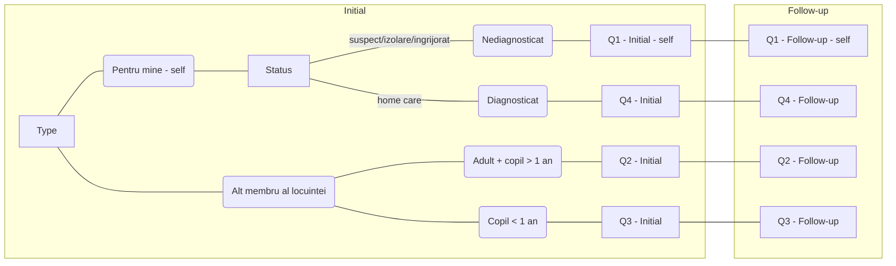

# StauAcasa

```mermaid
graph LR;

subgraph Initial
    T[Type]
    S[Status]
        ND(Nediagnosticat)
        D(Diagnosticat)
    Self(Pentru mine - self)
    Alt(Alt membru al locuintei)
        Adult(Adult + copil > 1 an)
        Copil(Copil < 1 an)

    Q1[Q1 - Initial - self]
    Q2[Q2 - Initial]
    Q3[Q3 - Initial]
    Q4[Q4 - Initial]
end

subgraph Follow-up
    Q1a[Q1 - Follow-up - self]
    Q2a[Q2 - Follow-up]
    Q3a[Q3 - Follow-up]
    Q4a[Q4 - Follow-up]
end
    
T---Self
Self---S
    S---|suspect/izolare/ingrijorat|ND
        ND---Q1
    S---|home care|D
        D---Q4
T---Alt
    Alt---Adult
        Adult---Q2
    Alt---Copil
        Copil---Q3

Q1---Q1a
Q2---Q2a
Q3---Q3a
Q4---Q4a
```